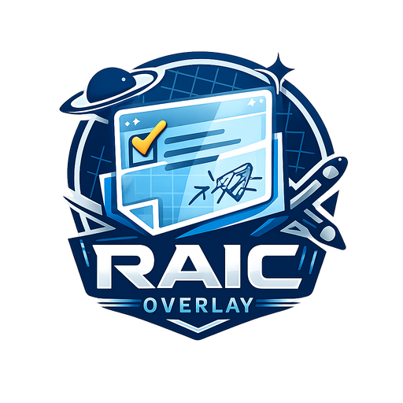
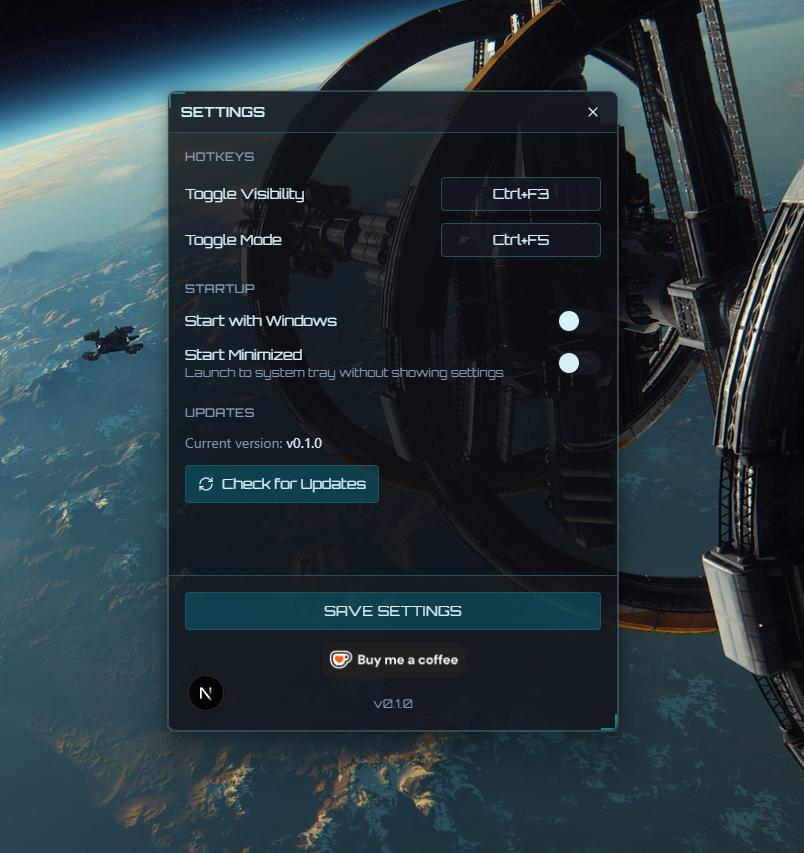

# RAIC Overlay

  

  
  

  

  or send me a aUEC Tip in game to my nickname <a href="https://robertsspaceindustries.com/en/citizens/braindaamage">braindaamage</a>

---

## About

RAIC Overlay is a customizable overlay for Star Citizen that stays on top of your game. It provides helpful tools like notes, drawing, and timers without interrupting your gameplay.

The overlay supports two modes: a transparent click-through mode that doesn't interfere with your game, and an interactive mode for when you need to use the tools.

## Screenshots

  

  <em>The overlay displayed over Star Citizen</em>

  

  <em>Settings panel</em>

## Installation

1. Download the latest installer from the [Releases page](https://github.com/RAIC-Organization/RAIC-Overlay/releases/latest)
2. Run the MSI installer
3. Launch RAIC Overlay from the Start Menu or Desktop shortcut

## Controls

| Shortcut | Action |
|----------|--------|
| **F3** | Show/Hide the overlay |
| **F5** | Toggle between click-through and interactive modes |

## Windows

The overlay includes several windows you can open from the main menu:

- **Notes** - Rich text editor for taking notes during gameplay
- **Draw** - Freehand drawing canvas for sketches and annotations
- **Browser** - Built-in web browser for quick reference
- **File Viewer** - View images, PDFs, and text files without leaving the game

## Widgets

Small utility widgets that stay visible on your overlay:

- **Clock** - Current time display
- **Session Timer** - Track how long you've been playing
- **Chronometer** - Stopwatch and countdown timer

## License

MIT License

Copyright (c) 2026 RAIC Organization

Permission is hereby granted, free of charge, to any person obtaining a copy
of this software and associated documentation files (the "Software"), to deal
in the Software without restriction, including without limitation the rights
to use, copy, modify, merge, publish, distribute, sublicense, and/or sell
copies of the Software, and to permit persons to whom the Software is
furnished to do so, subject to the following conditions:

The above copyright notice and this permission notice shall be included in all
copies or substantial portions of the Software.

THE SOFTWARE IS PROVIDED "AS IS", WITHOUT WARRANTY OF ANY KIND, EXPRESS OR
IMPLIED, INCLUDING BUT NOT LIMITED TO THE WARRANTIES OF MERCHANTABILITY,
FITNESS FOR A PARTICULAR PURPOSE AND NONINFRINGEMENT. IN NO EVENT SHALL THE
AUTHORS OR COPYRIGHT HOLDERS BE LIABLE FOR ANY CLAIM, DAMAGES OR OTHER
LIABILITY, WHETHER IN AN ACTION OF CONTRACT, TORT OR OTHERWISE, ARISING FROM,
OUT OF OR IN CONNECTION WITH THE SOFTWARE OR THE USE OR OTHER DEALINGS IN THE
SOFTWARE.
